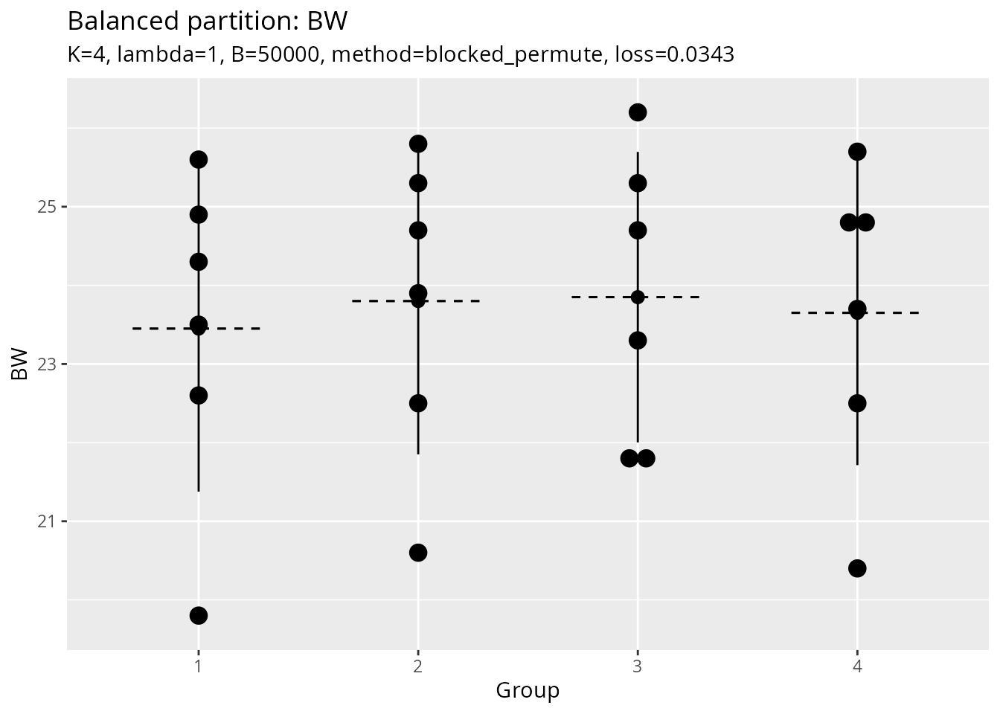

# Sample Partition

The
[`balanced_partition()`](https://wbvguo.github.io/Rtoolset/reference/balanced_partition.md)
function partitions samples into balanced groups while minimizing
variance in group means and standard deviations. This is useful for
creating balanced experimental groups, cross-validation folds, or
training/test splits.

## Overview

The partitioning algorithm minimizes:

``` math
\text{loss} = \text{Gini}(\text{group\_means}) + \lambda \times \text{Gini}(\text{group\_SDs})
```

where:

- `Gini(group_means)` measures inequality in group means

- `Gini(group_SDs)` measures inequality in group standard deviations

- `lambda` controls the trade-off between balancing means vs. SDs

## Basic Usage

### Simple partition

``` r
library(Rtoolset)

# Load external data
data_file <- system.file("extdata", "8988T.csv", package = "Rtoolset")
data <- read.csv(data_file)

head(data)
#>   NO.    L   W   BW
#> 1 221  8.8 7.7 19.8
#> 2 222 10.4 8.1 21.8
#> 3 223  9.2 8.4 20.6
#> 4 224  8.2 7.2 21.8
#> 5 225  9.2 8.1 20.4
#> 6 226  8.3 6.8 24.9
```

``` r
# Partition into 4 balanced groups based on BW (body weight)
result <- balanced_partition(
  data = data,
  score_col = "BW",
  id_col = "NO.",
  K = 4
)

# View the assignment
head(result$assignment)
#>    sample_id group score
#> 3        223     1  20.6
#> 9        231     1  22.5
#> 13       236     1  25.8
#> 15       238     1  24.7
#> 17       241     1  23.7
#> 18       242     1  25.3
```

### With Custom Group Sizes

``` r
# Specify exact group sizes
result <- balanced_partition(
  data = data,
  score_col = "BW",
  id_col = "NO.",
  group_sizes = c(6, 6, 6, 6)  # Must sum to the total number of samples
)
```

## Advanced Options

### Adjusting the Balance Trade-off

The `lambda` parameter controls how much weight to put on balancing
standard deviations:

``` r
# Emphasize mean balance (default lambda = 1)
result1 <- balanced_partition(
  data = data,
  score_col = "BW",
  K = 4,
  lambda = 0.5  # Less weight on SD balance
)

# Emphasize SD balance
result2 <- balanced_partition(
  data = data,
  score_col = "BW",
  K = 4,
  lambda = 2.0  # More weight on SD balance
)
```

### Partition Methods

Two methods are available:

``` r
# Blocked permutation (default, faster for large datasets)
result1 <- balanced_partition(
  data = data,
  score_col = "BW",
  K = 4,
  method = "blocked_permute"
)

# Random assignment (more thorough search)
result2 <- balanced_partition(
  data = data,
  score_col = "BW",
  K = 4,
  method = "random_assign",
  B = 10000  # More iterations for better results
)
```

### Output Options

Save plots and CSV files to a directory:

``` r
result <- balanced_partition(
  data = data,
  score_col = "BW",
  id_col = "NO.",
  K = 4,
  output_plot = TRUE,       # Generate visualization
  output_csv = FALSE,       # Set to TRUE to save CSV file
  output_dir = NULL,        # Set to directory path to save files
  file_prefix = "partition" # File prefix
)
```

## Understanding the Results

The function returns a list with several components:

``` r
result <- balanced_partition(data, score_col = "BW", K = 4, output_plot = TRUE)

# Assignment: which group each sample belongs to
result$assignment
#>    sample_id group score
#> 1          1     1  19.8
#> 6          6     1  24.9
#> 10        10     1  24.3
#> 12        12     1  25.6
#> 21        21     1  22.6
#> 23        23     1  23.5
#> 3          3     2  20.6
#> 7          7     2  25.3
#> 13        13     2  25.8
#> 16        16     2  24.7
#> 19        19     2  23.9
#> 20        20     2  22.5
#> 2          2     3  21.8
#> 4          4     3  21.8
#> 11        11     3  23.3
#> 15        15     3  24.7
#> 18        18     3  25.3
#> 22        22     3  26.2
#> 5          5     4  20.4
#> 8          8     4  24.7
#> 9          9     4  22.5
#> 14        14     4  25.7
#> 17        17     4  23.7
#> 24        24     4  24.9

# Group statistics: mean, SD, and n for each group
result$group_stats
#>   group   score.n score.mean  score.sd
#> 1     1  6.000000  23.450000  2.073403
#> 2     2  6.000000  23.800000  1.949359
#> 3     3  6.000000  23.850000  1.846889
#> 4     4  6.000000  23.650000  1.936750

# Loss value: lower is better
result$loss
#> [1] 0.03430415

# Group sizes used
result$group_sizes
#> [1] 6 6 6 6

# Plot object (if output_plot = TRUE)
result$plot
#> Bin width defaults to 1/30 of the range of the data. Pick better value with
#> `binwidth`.
```



## Use Cases

### 1. Experimental Design

Create balanced treatment groups:

``` r
# Create 4 balanced treatment groups using body weight
groups <- balanced_partition(
  data = data,
  score_col = "BW",
  id_col = "NO.",
  K = 4,
  output_plot = TRUE
)
```

### 2. Data Splitting for Train/Test

Create balanced splits for cross-validation or train/test sets:

``` r
# Cross-validation: Create 5-fold CV with balanced groups
cv_folds <- balanced_partition(
  data = data,
  score_col = "BW",
  K = 5
)

# Use the groups for cross-validation
for (fold in 1:5) {
  test_indices <- which(cv_folds$assignment$group == fold)
  train_indices <- which(cv_folds$assignment$group != fold)
  # ... perform CV ...
}
```

``` r
# Training/Test Split: 80/20 split (approximately 19 and 5 samples)
split <- balanced_partition(
  data = data,
  score_col = "BW",
  group_sizes = c(19, 5)
)

train_data <- data[split$assignment$group == 1, ]
test_data <- data[split$assignment$group == 2, ]
```

## Tips and Best Practices

1.  **Data Quality**: Ensure your score column has no missing values
2.  **Group Sizes**: For best results, groups should be roughly equal in
    size
3.  **Lambda Tuning**: Start with `lambda = 1`, adjust based on your
    needs
4.  **Reproducibility**: Use `seed` parameter for reproducible results
5.  **Visualization**: Always check `output_plot = TRUE` to verify
    balance

## Algorithm Details

The core algorithm (`balance_partition_core`) uses a random search
approach:

1.  Generate candidate partitions using the selected method
2.  Evaluate each partition using the Gini-based loss function
3.  Iterate through candidates and return the partition with the lowest
    loss

The number of candidates (`B`) can be increased for better results at
the cost of computation time.

## See Also

- Function reference:
  [`?balanced_partition`](https://wbvguo.github.io/Rtoolset/reference/balanced_partition.md),
  [`?balance_partition_core`](https://wbvguo.github.io/Rtoolset/reference/balance_partition_core.md)
