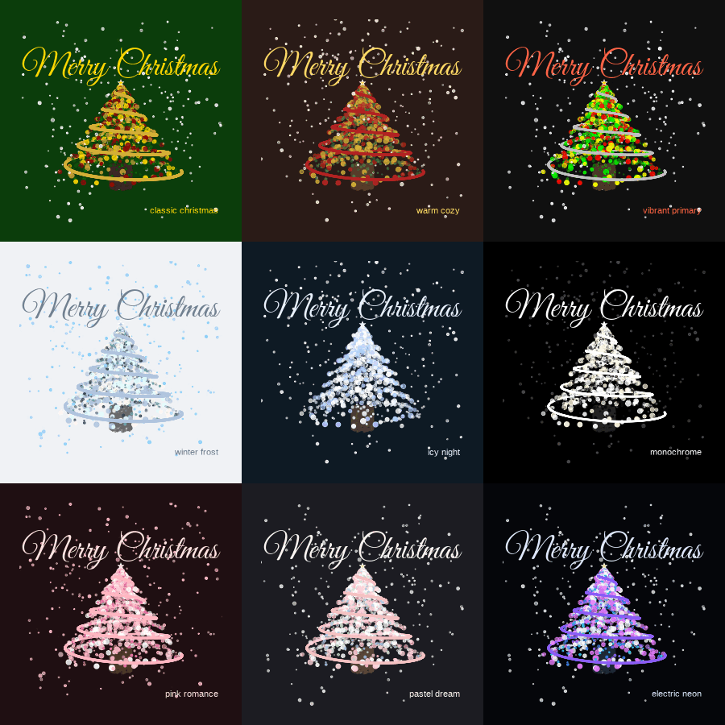

# Rtoolset

**Rtoolset** is a miscellaneous tool set for R programming and data
analysis, providing utility functions for:

- 📊 [Sample
  Operations](https://wbvguo.github.io/Rtoolset/articles/sample-partition.md):
  Balanced partition
- 🔬 [Feature
  Operations](https://wbvguo.github.io/Rtoolset/articles/rnaseq-workflow.md):
  Selection and filtering
- 🔄 [Data
  Transformation](https://wbvguo.github.io/Rtoolset/articles/dnam-workflow.md):
  Common transformations
- 💻 [R
  Programming](https://wbvguo.github.io/Rtoolset/articles/utilities-guide.md):
  String matching, formatting, objects
- 🔧 [General
  Utilities](https://wbvguo.github.io/Rtoolset/articles/utilities-guide.md):
  File management, package installation
- 🎮 [Visualization &
  Fun](https://wbvguo.github.io/Rtoolset/articles/visualization.md):
  Interesting visualizations and games

*and more to come…*


## Installation

You can install Rtoolset from
[GitHub](https://github.com/wbvguo/Rtoolset.git) with:

``` r
# Using pak (recommended)
install.packages("pak")
pak::pak("wbvguo/Rtoolset")

# Or using remotes
install.packages("remotes")
remotes::install_github("wbvguo/Rtoolset")
```

## Quick Start

``` r
library(Rtoolset)

# Example: Create animated Christmas trees
draw_xmas_tree_gif_panel()
```



## Documentation

1.  **[Full Documentation](https://wbvguo.github.io/Rtoolset/)** -
    Browse all functions and articles (currently under construction)

2.  **Vignettes** - Detailed tutorials (available after installation):

    ``` r
    browseVignettes("Rtoolset")
    ```

3.  For function reference, use standard R help:

    ``` r
    ?closestMatch
    ```
